# Awesome Shodan Search Queries [](https://awesome.re)


**Based on a blog post at https://jarv.is/notes/shodan-search-queries/.**


Over time, I've collected an assortment of interesting, funny, and depressing search queries to plug into [Shodan](https://www.shodan.io/), the ([literal](https://www.vice.com/en_uk/article/9bvxmd/shodan-exposes-the-dark-side-of-the-net)) internet search engine. Some return facepalm-inducing results, while others return serious and/or ancient vulnerabilities in the wild.

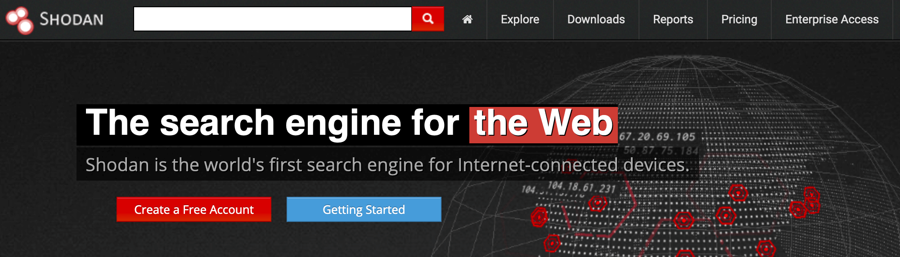
*[Most search filters require a Shodan account.](https://account.shodan.io/register)*

You can assume these queries only return unsecured/open instances when possible. For your own legal benefit, do not attempt to login (even with default passwords) if they aren't! Narrow down results by adding filters like `country:US` or `org:"Harvard University"` or `hostname:"nasa.gov"` to the end.

The world and its devices are quickly becoming more connected through the shiny new [Internet of ~~Things~~ Sh*t](https://motherboard.vice.com/en_us/topic/internet-of-shit) — and exponentially [more dangerous](https://blog.malwarebytes.com/101/2017/12/internet-things-iot-security-never/) as a result. To that end, I hope this list spreads awareness (and, quite frankly, pant-wetting fear) rather than harm. 

**And as always, [discover and disclose responsibly](https://www.bugcrowd.com/resource/what-is-responsible-disclosure/)! 😊**


---


### **Table of Contents**

- [Industrial Control Systems](#industrial-control-systems)
- [Remote Desktop](#remote-desktop)
- [Network Infrastructure](#network-infrastructure)
- [Network Attached Storage (NAS)](#network-attached-storage-nas)
- [Webcams](#webcams)
- [Printers & Copiers](#printers--copiers)
- [Home Devices](#home-devices)
- [Random Stuff](#random-stuff)


---


## Industrial Control Systems


### Samsung Electronic Billboards [&#x2192;](https://www.shodan.io/search?query=%22Server%3A+Prismview+Player%22)

```
"Server: Prismview Player"
```


### Gas Station Pump Controllers [&#x2192;](https://www.shodan.io/search?query=%22in-tank+inventory%22+port%3A10001)

```
"in-tank inventory" port:10001
```


### Automatic License Plate Readers [&#x2192;](https://www.shodan.io/search?query=P372+%22ANPR+enabled%22)

```
P372 "ANPR enabled"
```

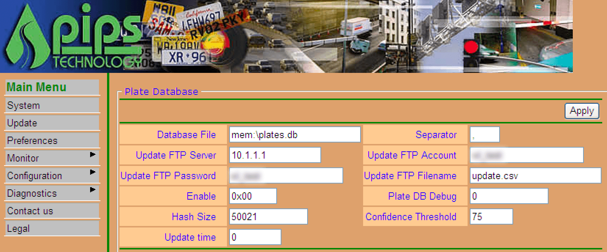


### Traffic Light Controllers / Red Light Cameras [&#x2192;](https://www.shodan.io/search?query=mikrotik+streetlight)

```
mikrotik streetlight
```


### Voting Machines in the United States [&#x2192;](https://www.shodan.io/search?query=%22voter+system+serial%22+country%3AUS)

```
"voter system serial" country:US
```


### Prison Pay Phones [&#x2192;](https://www.shodan.io/search?query=%22%5B2J%5BH+Encartele+Confidential%22)

```
"[2J[H Encartele Confidential"
```


### [Tesla PowerPack](https://www.tesla.com/powerpack) Charging Status [&#x2192;](https://www.shodan.io/search?query=http.title%3A%22Tesla+PowerPack+System%22+http.component%3A%22d3%22+-ga3ca4f2)

```
http.title:"Tesla PowerPack System" http.component:"d3" -ga3ca4f2
```

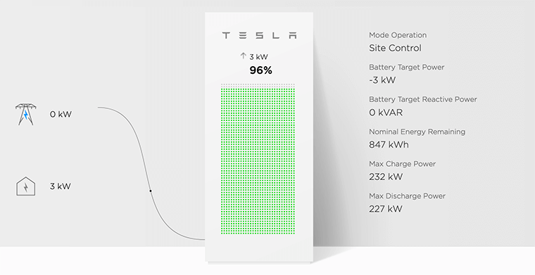


### Electric Vehicle Chargers [&#x2192;](https://www.shodan.io/search?query=%22Server%3A+gSOAP%2F2.8%22+%22Content-Length%3A+583%22)

```
"Server: gSOAP/2.8" "Content-Length: 583"
```


### [Nordex Wind Turbine](http://www.nordex-online.com/en/products-services/wind-turbines.html) Farms [&#x2192;](https://www.shodan.io/search?query=http.title%3A%22Nordex+Control%22+%22Windows+2000+5.0+x86%22+%22Jetty%2F3.1+%28JSP+1.1%3B+Servlet+2.2%3B+java+1.6.0_14%29%22)

```
http.title:"Nordex Control" "Windows 2000 5.0 x86" "Jetty/3.1 (JSP 1.1; Servlet 2.2; java 1.6.0_14)"
```


### [C4 Max](https://www.mobile-devices.com/our-products/c4-max/) Commercial Vehicle GPS Trackers [&#x2192;](https://www.shodan.io/search?query=%22%5B1m%5B35mWelcome+on+console%22)

```
"[1m[35mWelcome on console"
```

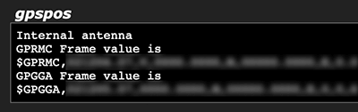


### [DICOM](https://www.dicomstandard.org/about/) Medical X-Ray Machines [&#x2192;](https://www.shodan.io/search?query=%22DICOM+Server+Response%22+port%3A104)

Secured by default, thankfully, but these 1,700+ machines still [have no business](https://documents.trendmicro.com/assets/rpt/rpt-securing-connected-hospitals.pdf) being on the internet.

```
"DICOM Server Response" port:104
```


### [GaugeTech](https://electroind.com/all-products/) Electricity Meters [&#x2192;](https://www.shodan.io/search?query=%22Server%3A+EIG+Embedded+Web+Server%22+%22200+Document+follows%22)

```
"Server: EIG Embedded Web Server" "200 Document follows"
```

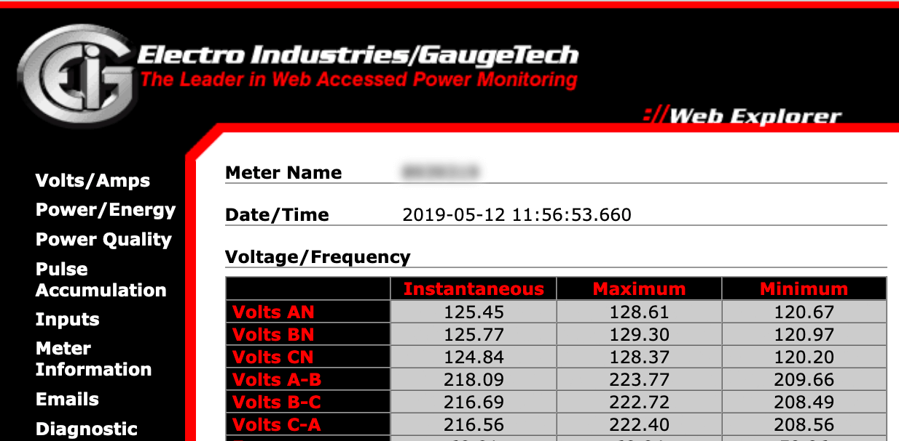


### Siemens Industrial Automation [&#x2192;](https://www.shodan.io/search?query=%22Siemens%2C+SIMATIC%22+port%3A161)

```
"Siemens, SIMATIC" port:161
```


### Siemens HVAC Controllers [&#x2192;](https://www.shodan.io/search?query=%22Server%3A+Microsoft-WinCE%22+%22Content-Length%3A+12581%22)

```
"Server: Microsoft-WinCE" "Content-Length: 12581"
```


### Door / Lock Access Controllers [&#x2192;](https://www.shodan.io/search?query=%22HID+VertX%22+port%3A4070)

```
"HID VertX" port:4070
```


### Railroad Management [&#x2192;](https://www.shodan.io/search?query=%22log+off%22+%22select+the+appropriate%22)

```
"log off" "select the appropriate"
```


---


## Remote Desktop


### Unprotected VNC [&#x2192;](https://www.shodan.io/search?query=%22authentication+disabled%22+%22RFB+003.008%22)

```
"authentication disabled" "RFB 003.008"
```

[Shodan Images](https://images.shodan.io/) is a great supplementary tool to browse screenshots, by the way!  [&#x2192;](https://images.shodan.io/?query=%22authentication+disabled%22+%21screenshot.label%3Ablank)

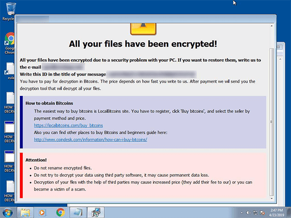

*The first result right now. 😞*


### Windows RDP [&#x2192;](https://www.shodan.io/search?query=%22%5Cx03%5Cx00%5Cx00%5Cx0b%5Cx06%5Cxd0%5Cx00%5Cx00%5Cx124%5Cx00%22)

99.99% are secured by a secondary Windows login screen.

```
"\x03\x00\x00\x0b\x06\xd0\x00\x00\x124\x00"
```


---


## Network Infrastructure


### MongoDB [&#x2192;](https://www.shodan.io/search?query=product%3AMongoDB+-authentication)

Older versions were insecure by default. [Very scary.](https://krebsonsecurity.com/tag/mongodb/)

```
"MongoDB Server Information" port:27017 -authentication
```

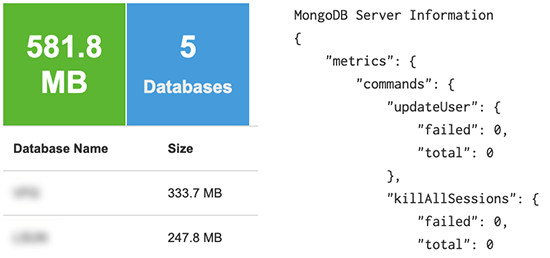


### Jenkins CI [&#x2192;](https://www.shodan.io/search?query=%22X-Jenkins%22+%22Set-Cookie%3A+JSESSIONID%22+http.title%3A%22Dashboard%22)

```
"X-Jenkins" "Set-Cookie: JSESSIONID" http.title:"Dashboard"
```

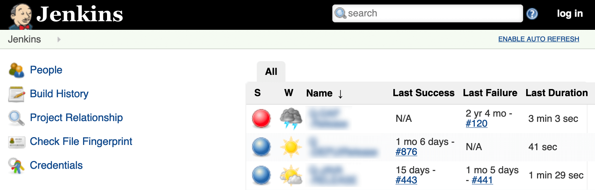


### Docker APIs [&#x2192;](https://www.shodan.io/search?query=%22Docker+Containers%3A%22+port%3A2375)

```
"Docker Containers:" port:2375
```


### [Pi-hole](https://pi-hole.net/) Open DNS Servers [&#x2192;](https://www.shodan.io/search?query=%22dnsmasq-pi-hole%22+%22Recursion%3A+enabled%22)

```
"dnsmasq-pi-hole" "Recursion: enabled"
```


### Already Logged-In as `root` via Telnet [&#x2192;](https://www.shodan.io/search?query=%22root%40%22+port%3A23+-login+-password+-name+-Session)

```
"root@" port:23 -login -password -name -Session
```


### Android Root Bridges [&#x2192;](https://www.shodan.io/search?query=%22Android+Debug+Bridge%22+%22Device%22+port%3A5555)

A tangential result of Google's dumb fractured update approach. 🙄 [More information here.](https://medium.com/p/root-bridge-how-thousands-of-internet-connected-android-devices-now-have-no-security-and-are-b46a68cb0f20)

```
"Android Debug Bridge" "Device" port:5555
```


### Lantronix Serial-to-Ethernet Adapter [Leaking Telnet Passwords](https://www.bleepingcomputer.com/news/security/thousands-of-serial-to-ethernet-devices-leak-telnet-passwords/) [&#x2192;](https://www.shodan.io/search?query=Lantronix+password+port%3A30718+-secured)

```
Lantronix password port:30718 -secured
```


### Citrix Virtual Apps [&#x2192;](https://www.shodan.io/search?query=%22Citrix+Applications%3A%22+port%3A1604)

```
"Citrix Applications:" port:1604
```

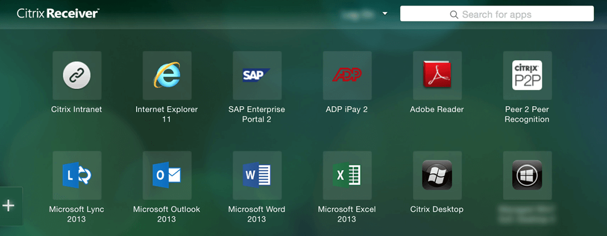


### Cisco Smart Install [&#x2192;](https://www.shodan.io/search?query=%22smart+install+client+active%22)

[Vulnerable](https://2016.zeronights.ru/wp-content/uploads/2016/12/CiscoSmartInstall.v3.pdf) (kind of "by design," but especially when exposed).

```
"smart install client active"
```


### PBX IP Phone Gateways [&#x2192;](https://www.shodan.io/search?query=PBX+%22gateway+console%22+-password+port%3A23)


```
PBX "gateway console" -password port:23
```


### [Polycom](https://www.polycom.com/hd-video-conferencing.html) Video Conferencing [&#x2192;](https://www.shodan.io/search?query=http.title%3A%22-+Polycom%22+%22Server%3A+lighttpd%22)

```
http.title:"- Polycom" "Server: lighttpd"
```

Telnet Configuration: [&#x2192;](https://www.shodan.io/search?query=%22Polycom+Command+Shell%22+-failed+port%3A23)

```
"Polycom Command Shell" -failed port:23
```

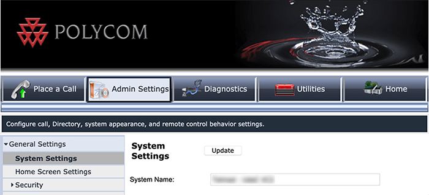


### [Bomgar Help Desk](https://www.beyondtrust.com/remote-support/integrations) Portal [&#x2192;](https://www.shodan.io/search?query=%22Server%3A+Bomgar%22+%22200+OK%22)

```
"Server: Bomgar" "200 OK"
```


### Intel Active Management [CVE-2017-5689](https://www.exploit-db.com/exploits/43385) [&#x2192;](https://www.shodan.io/search?query=%22Intel%28R%29+Active+Management+Technology%22+port%3A623%2C664%2C16992%2C16993%2C16994%2C16995)

```
"Intel(R) Active Management Technology" port:623,664,16992,16993,16994,16995
```


### HP iLO 4 [CVE-2017-12542](https://nvd.nist.gov/vuln/detail/CVE-2017-12542) [&#x2192;](https://www.shodan.io/search?query=HP-ILO-4+%21%22HP-ILO-4%2F2.53%22+%21%22HP-ILO-4%2F2.54%22+%21%22HP-ILO-4%2F2.55%22+%21%22HP-ILO-4%2F2.60%22+%21%22HP-ILO-4%2F2.61%22+%21%22HP-ILO-4%2F2.62%22+port%3A1900)

```
HP-ILO-4 !"HP-ILO-4/2.53" !"HP-ILO-4/2.54" !"HP-ILO-4/2.55" !"HP-ILO-4/2.60" !"HP-ILO-4/2.61" !"HP-ILO-4/2.62" port:1900
```


### Outlook Web Access:

#### Exchange 2007 [&#x2192;](https://www.shodan.io/search?query=%22x-owa-version%22+%22IE%3DEmulateIE7%22+%22Server%3A+Microsoft-IIS%2F7.0%22)

```
"x-owa-version" "IE=EmulateIE7" "Server: Microsoft-IIS/7.0"
```

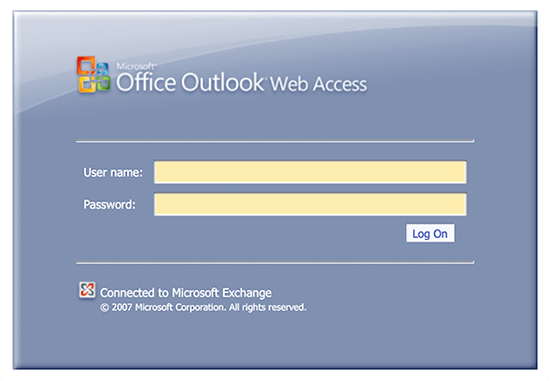

#### Exchange 2010 [&#x2192;](https://www.shodan.io/search?query=%22x-owa-version%22+%22IE%3DEmulateIE7%22+http.favicon.hash%3A442749392)

```
"x-owa-version" "IE=EmulateIE7" http.favicon.hash:442749392
```

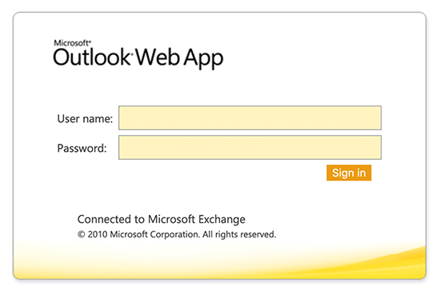

#### Exchange 2013 / 2016 [&#x2192;](https://www.shodan.io/search?query=%22X-AspNet-Version%22+http.title%3A%22Outlook%22+-%22x-owa-version%22)

```
"X-AspNet-Version" http.title:"Outlook" -"x-owa-version"
```


### Lync / Skype for Business [&#x2192;](https://www.shodan.io/search?query=%22X-MS-Server-Fqdn%22)

```
"X-MS-Server-Fqdn"
```


---


## Network Attached Storage (NAS)


### SMB (Samba) File Shares [&#x2192;](https://www.shodan.io/search?query=%22Authentication%3A+disabled%22+port%3A445)

Produces ~500,000 results...narrow down by adding "Documents" or "Videos", etc.

```
"Authentication: disabled" port:445
```

Specifically domain controllers: [&#x2192;](https://www.shodan.io/search?query=%22Authentication%3A+disabled%22+NETLOGON+SYSVOL+-unix+port%3A445)

```
"Authentication: disabled" NETLOGON SYSVOL -unix port:445
```


### Iomega / LenovoEMC NAS Drives [&#x2192;](https://www.shodan.io/search?query=%22Set-Cookie%3A+iomega%3D%22+-%22manage%2Flogin.html%22+-http.title%3A%22Log+In%22)

```
"Set-Cookie: iomega=" -"manage/login.html" -http.title:"Log In"
```

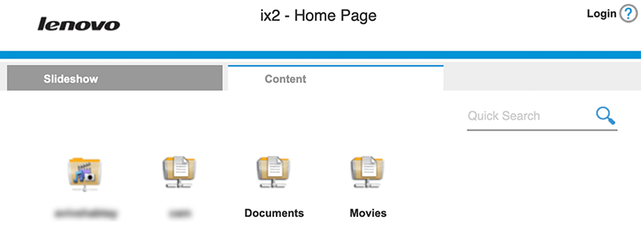


### Buffalo TeraStation NAS Drives [&#x2192;](https://www.shodan.io/search?query=Redirecting+sencha+port%3A9000)

```
Redirecting sencha port:9000
```

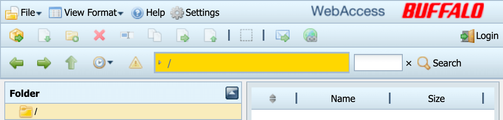


### Logitech Media Servers [&#x2192;](https://www.shodan.io/search?query=%22Server%3A+Logitech+Media+Server%22+%22200+OK%22)

```
"Server: Logitech Media Server" "200 OK"
```

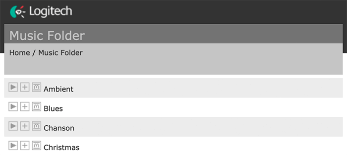


### [Plex](https://www.plex.tv/) Media Servers [&#x2192;](https://www.shodan.io/search?query=%22X-Plex-Protocol%22+%22200+OK%22+port%3A32400)

```
"X-Plex-Protocol" "200 OK" port:32400
```


### [Tautulli / PlexPy](https://github.com/Tautulli/Tautulli) Dashboards [&#x2192;](https://www.shodan.io/search?query=%22CherryPy%2F5.1.0%22+%22%2Fhome%22)

```
"CherryPy/5.1.0" "/home"
```

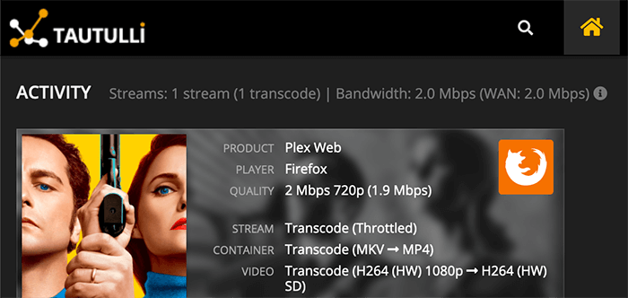


---


## Webcams

Example images not necessary. 🤦

### Yawcams [&#x2192;](https://www.shodan.io/search?query=%22Server%3A+yawcam%22+%22Mime-Type%3A+text%2Fhtml%22)

```
"Server: yawcam" "Mime-Type: text/html"
```


### webcamXP/webcam7 [&#x2192;](https://www.shodan.io/search?query=%28%22webcam+7%22+OR+%22webcamXP%22%29+http.component%3A%22mootools%22+-401)

```
("webcam 7" OR "webcamXP") http.component:"mootools" -401
```


### Android IP Webcam Server [&#x2192;](https://www.shodan.io/search?query=%22Server%3A+IP+Webcam+Server%22+%22200+OK%22)

```
"Server: IP Webcam Server" "200 OK"
```


### Security DVRs [&#x2192;](https://www.shodan.io/search?query=html%3A%22DVR_H264+ActiveX%22)

```
html:"DVR_H264 ActiveX"
```


---


## Printers & Copiers:


### HP Printers [&#x2192;](https://www.shodan.io/search?query=%22Serial+Number%3A%22+%22Built%3A%22+%22Server%3A+HP+HTTP%22)

```
"Serial Number:" "Built:" "Server: HP HTTP"
```

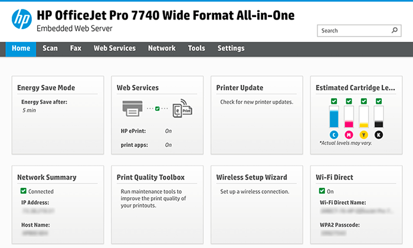


### Xerox Copiers/Printers [&#x2192;](https://www.shodan.io/search?query=ssl%3A%22Xerox+Generic+Root%22)

```
ssl:"Xerox Generic Root"
```

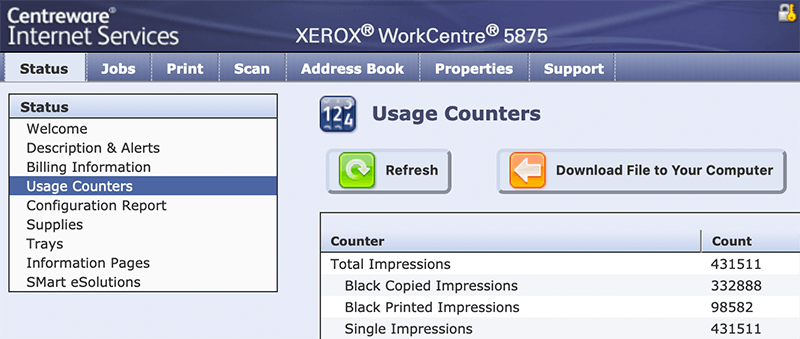


### Epson Printers [&#x2192;](https://www.shodan.io/search?query=%22SERVER%3A+EPSON_Linux+UPnP%22+%22200+OK%22)

```
"SERVER: EPSON_Linux UPnP" "200 OK"
```

```
"Server: EPSON-HTTP" "200 OK"
```

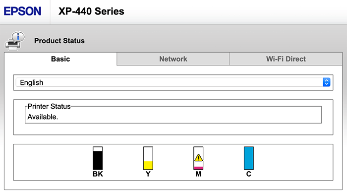


### Canon Printers [&#x2192;](https://www.shodan.io/search?query=%22Server%3A+KS_HTTP%22+%22200+OK%22)

```
"Server: KS_HTTP" "200 OK"
```

```
"Server: CANON HTTP Server"
```


--- 


## Home Devices


### Yamaha Stereos [&#x2192;](https://www.shodan.io/search?query=%22Server%3A+AV_Receiver%22+%22HTTP%2F1.1+406%22)

```
"Server: AV_Receiver" "HTTP/1.1 406"
```

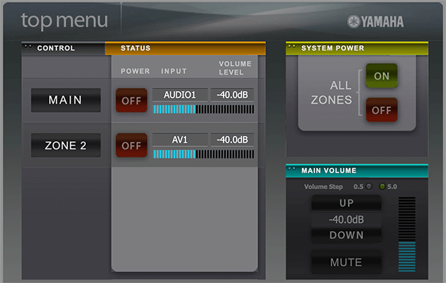


### Apple AirPlay Receivers [&#x2192;](https://www.shodan.io/search?query=%22%5Cx08_airplay%22+port%3A5353)

Apple TVs, HomePods, etc.

```
"\x08_airplay" port:5353
```


### Chromecasts / Smart TVs [&#x2192;](https://www.shodan.io/search?query=%22Chromecast%3A%22+port%3A8008)

```
"Chromecast:" port:8008
```


### [Crestron Smart Home](https://www.crestron.com/Products/Market-Solutions/Residential-Solutions) Controllers [&#x2192;](https://www.shodan.io/search?query=%22Model%3A+PYNG-HUB%22)

```
"Model: PYNG-HUB"
```

---


## Random Stuff


### OctoPrint 3D Printer Controllers [&#x2192;](https://www.shodan.io/search?query=title%3A%22OctoPrint%22+-title%3A%22Login%22+http.favicon.hash%3A1307375944)

```
title:"OctoPrint" -title:"Login" http.favicon.hash:1307375944
```

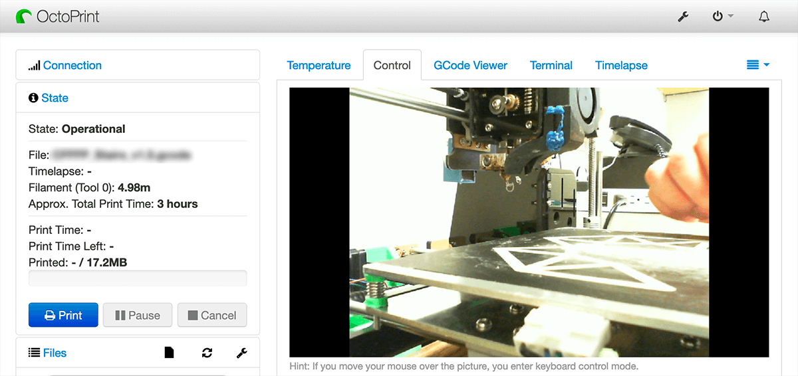


### Etherium Miners [&#x2192;](https://www.shodan.io/search?query=%22ETH+-+Total+speed%22)

```
"ETH - Total speed"
```

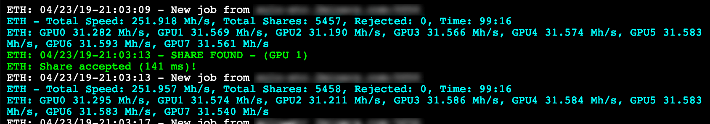


### Apache Directory Listings [&#x2192;](https://www.shodan.io/search?query=http.title%3A%22Index+of+%2F%22+http.html%3A%22.pem%22)

Substitute `.pem` with any extension or a filename like `phpinfo.php`.

```
http.title:"Index of /" http.html:".pem"
```


### Too Many Minecraft Servers [&#x2192;](https://www.shodan.io/search?query=%22Minecraft+Server%22+%22protocol+340%22+port%3A25565)

```
"Minecraft Server" "protocol 340" port:25565
```


### Literally [Everything](https://www.vox.com/2014/12/22/7435625/north-korea-internet) in North Korea 🇰🇵 [&#x2192;](https://www.shodan.io/search?query=net%3A175.45.176.0%2F22%2C210.52.109.0%2F24)

```
net:175.45.176.0/22,210.52.109.0/24,77.94.35.0/24
```


### TCP Quote of the Day [&#x2192;](https://www.shodan.io/search?query=port%3A17+product%3A%22Windows+qotd%22)

Port 17 ([RFC 865](https://tools.ietf.org/html/rfc865)) has a [bizarre history](https://en.wikipedia.org/wiki/QOTD)...

```
port:17 product:"Windows qotd"
```


### Find a Job Doing This! 👩‍💼 [&#x2192;](https://www.shodan.io/search?query=%22X-Recruiting%3A%22)

```
"X-Recruiting:"
```


---


If you've found any other juicy Shodan gems, whether it's a search query or a specific example, definitely [drop a comment](https://jarv.is/notes/shodan-search-queries/#commento) on the blog or [open an issue/PR here on GitHub](https://github.com/jakejarvis/awesome-shodan-queries).

Bon voyage, fellow penetrators! 😉


## License

[](https://creativecommons.org/publicdomain/zero/1.0/)

To the extent possible under law, [Jake Jarvis](https://jarv.is/) has waived all copyright and related or neighboring rights to this work.
